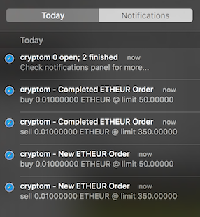

# cryptom

Cryptocurrency Orders Monitor



## Requirements

* OSX
* [Kraken exchange](https://www.kraken.com) account
* homebrew (or you can manually download from releases page)

## Setup

You need to create an API key that allows querying open/closed
orders. In order to do this go to  your
[Kraken API page](https://www.kraken.com/u/settings/api) and
`Generate New Key` with the `Query Open Orders & Trades` permission.

Add the generated Key and Secret to a file called `.cryptom.toml` in
your home directory (replace *KEY / SECRET* with the values from
previous step):

```bash
echo "" >> ~/.cryptom.toml
echo kraken-key=\"KEY\" >> ~/.cryptom.toml
echo kraken-secret=\"SECRET\" >> ~/.cryptom.toml
```

Now install and run:

```bash
# install via homebrew
brew install andreiashu/cryptom/cryptom

# alternatively you can also download from the releases page:
# https://github.com/andreiashu/cryptom/releases

# run cryptom (in foreground)
$ cryptom
Listening for order updates...

# or you can run and send it to background
$ cryptom &
[1] 78130
Listening for order updates...

# if you have any active orders you should now see a notification
# when orders finish (or get cancelled) or when you place new
orders cryptom will show you a notification
```